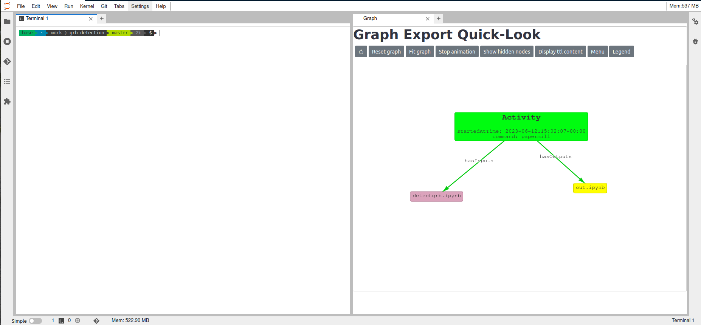

# Workflow development Guide

Workflows are all things that can be computed, broadly speaking. 

For reproducibility, we want our workflows to be repeatable: producing the same output every time they are computed. 
This is easy enough to do in first approximation, but might be harder to achieve than it seems when the workflow relies on external resources. But we track every execution so it is not necessary to be overly concerned about these delicate details at every moment.

Generally, we want the workflows to be parametrized. Non-parametrized but strickly repeatable notebooks are less **reusable** since they always produce the same output data.

One way to create them in ODA is to build **jupyter notebook**.

## Simple ODA Jupyter Notebook to a workflow

### Write a working repeatable workflow

First you need to make sure your notebook runs in a cloud environment. It needs to be repeatable - i.e. you can run it many times. If it depends on external services - try to make sure the requests are also repeatable - you might need to specify sufficient details. If the notebook does not produce the exactly
the same result every time - it's unfortunate, but do not worry too much, it might still be reproducible (see motivation on [the difference between reproducibility and repeatability](https://github.com/volodymyrss/reproducibility-motivation/))

* write your notebook, and make sure it runs from top to bottom
* make a requirements.txt will the modules you need for this notebook

You can use mock [notebooks](https://renkulab.io/gitlab/astronomy/mmoda/mmoda-nb2workflow-example/-/tree/master/notebooks) as examples.

### Parametetrize the notebook 

Create a cell with the following tag "parameters" (see [papermill manual](https://papermill.readthedocs.io/en/latest/usage-parameterize.html#designate-parameters-for-a-cell)):
  * the names of the declared variables will be used as parameter names in the MMODA service (except the **default** parameters, see below)
  * if not annotated, the types of the inputs parameters are determined based on the parameter default value
  * one can annotate the input parameter by putting comment with the `term` from the [ontology](https://odahub.io/docs/guide-ontology).

#### Default parameters

Several **default** common parameters are always set by the MMODA frontend. These include:

  | Type annotation | Parameter default name |
  | ---------------- | -------------- |
  | http://odahub.io/ontology#PointOfInterestRA | RA |
  | http://odahub.io/ontology#PointOfInterestDEC | DEC |
  | http://odahub.io/ontology#StartTime | T1 |
  | http://odahub.io/ontology#EndTime | T2 |
  | http://odahub.io/ontology#AstrophysicalObject | src_name |
  
If notebook contains parameters anotated with these types, their names will be automatically converted by the dispatcher plugin to the default ones. If some of them are ommited, they will be added to the list of workflow parameters automatically.


Note that both target (Point of Interest) **source name** and target **source coordinates** are passed to the workflow, and in principle there is no guarantee the coordinates are that of the source. Indeed the exact choice of the coordinates for a given source depends on the energy band, desired precision, etc. For now, we leave is up to the workflow developer to reconcile these parameters.

    

### Annotate the notebook outputs

* define the notebook output, similarly creating cell with tag "outputs". 
  * outputs may be strings, floats, lists
  * outputs may be also strings which contain filenames for valid files. If they do, the whole file will be considered output.
* if you want to give more detailed description of the notebook input and output, use `terms` from the [ontology]([docs/guide-ontology.](https://odahub.io/docs/guide-ontology)).


### Adding annotations the entire notebook

Annotations can apply to parameters or entire notebook. In both cases they are kept in the notebook cell tagged `parameters`.
For example:

```
# oda:version "v0.1.1"
# oda:reference "https://doi.org/10.1051/0004-6361/202037850"

source_name = "Crab" # oda:AstrophysicalObject
reference_energy = 20 # oda:keV
```

### Publish your workflow as a test service
* publish the workflow to RenkuLab in the dedicated group: https://renkulab.io/gitlab/astronomy/mmoda/
* add a "live-workflow" topic.


* once some bots do their job, the workflow will be automatically installed in [MMODA](https://www.astro.unige.ch/mmoda) (by default, on a staging instance), and you will recieve an email!
####  Try to access your new service

* Assuming `lightcurve-example` from above was used, and the notebook name was `random`, you can run this:

```bash
$ oda-api -u https://dispatcher-staging.odahub.io get -i lightcurve-example -p random -a n_bins=5
```

TODO: workflow version, plot here and in renku create


### (optional) Try a test service

* install nb2workflow tooling `pip install 'nb2workflow[cwl,service,rdf,mmoda]>=1.3.30' --upgrade`. Note that his command should be the only one you need to install the necessary dependencies for the workflow engine. You may of course also need some domain-specific packages .
* inspect the notebook `nbinspect my-notebook.ipynb`
* try to run the notebook `nbrun my-notebook.ipynb`
  * it will use all default parameters 
  * you can specify parameters as `nbrun --inp-nbins=10 my-notebook.ipynb`, if `nbins` happens to be one of the parameters.
 try to start the service `nb2service my-notebook.ipynb`


if you experience issues testing the service due to some "import error" or other strange messages try containerized service (note that it will not work in Renku):

* `nb2deploy $PWD test --local`
* then, look onto http://0.0.0.0:8000 for some metadata about the service
* try to run some simple queries in http://0.0.0.0:8000/apidocs/



If you still experience issues with local environment, try to develop the workflow directly in [renkulab]() - note that some commands, `like nb2deploy`, will not work in this case.


### Developing service in Renku


https://renkulab.io/

TODO: explain how to run server

To support the development of workflows in Renku, a set of dedicated funcitonailities, provided as Renku plugins, are made available. In particular those aim to:

* Offer an interactive (and non) visualization of the project Knowledge Graph (`renku-graph-vis` plugin)
* Create dedicated annotations for the execution of `astroquery` functions and add those to the project Knowledge Graph (`renku-aqs-annotation` plugin)

Those two set of features are provided within different plugins.

### Visualizing project Knowledge Graph with `renku-graph-vis` plugin

Starting from the knowledge graph, this is used to generate an interactive graphical representation of the graph itself.

The plugin provides two CLI commands:
  * `display` to generate a representation of the graph over an output image
  * `show-graph` to start an interactive visualization of the graph over the browser

In addition, the plugin offers a dynamic visualization of the graph during an interactive renku session.

More is explained at the repo page: [https://github.com/oda-hub/renku-graph-vis/](https://github.com/oda-hub/renku-graph-vis/)




### Tracking access to astronomical archives and services in the project Knowledge Graph by using `renku-aqs-annotation` plugin

By this plugin the calls to a number of `astroquery` methods are intercepted and spcific annotations are generated. Those will be then added to the project Knowledge Graph: [https://github.com/oda-hub/renku-aqs-annotation](https://github.com/oda-hub/renku-aqs-annotation)

### Installation

In order to have access to those functionalities, the relative plugins should be installed. This can be done either via pip:

```bash
pip install renku_graph_vis
pip install renku_aqs_annotation
```

Or can be made available within a Renku session, by adding those in the list of requirements of the Renku project, within your `requirements.txt` file.

### (optional) Add some verification test cases

To make sure your service does not break with future updates, it's useful to express some assumptions about the service outputs in some reference cases.
They will be tested automatically every time new workflow version is installed.

we will explain later how to do this.
