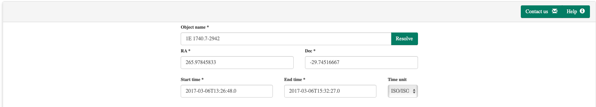
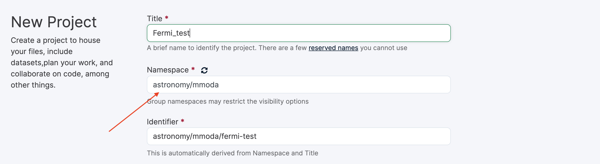
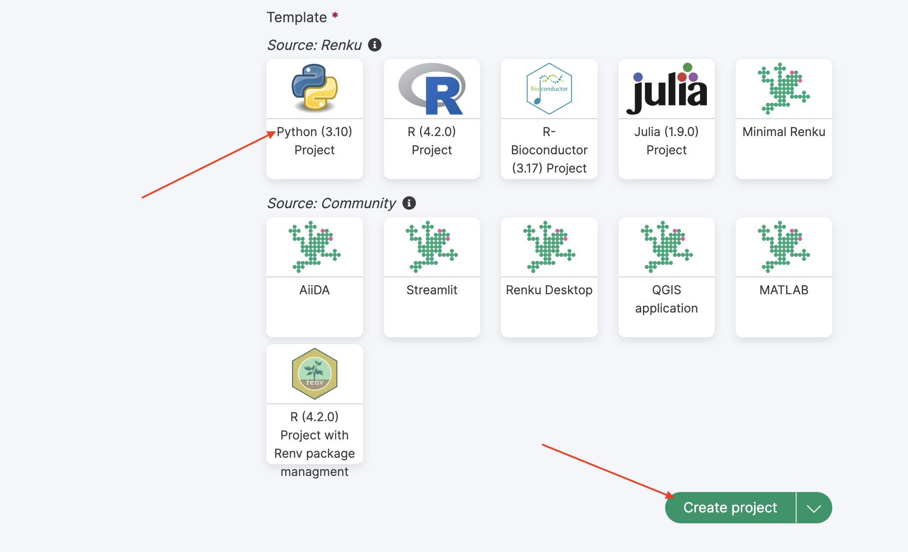
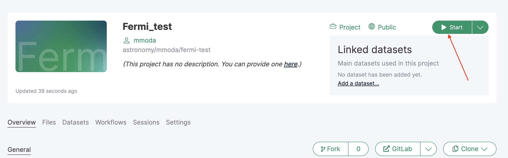
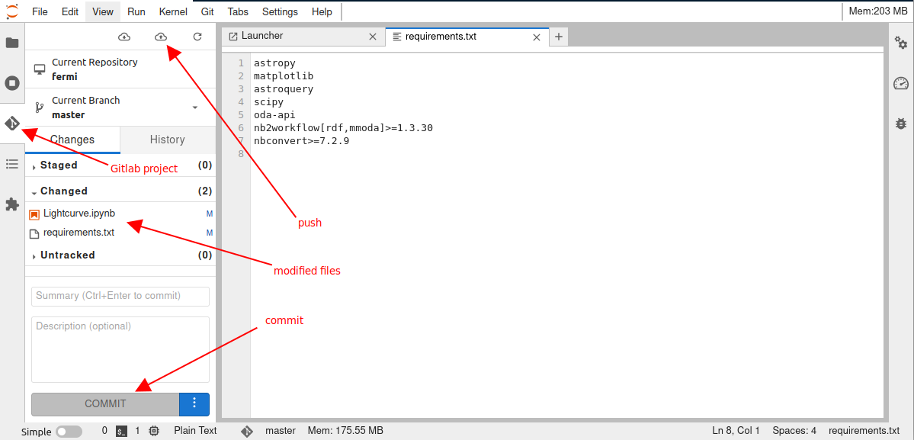
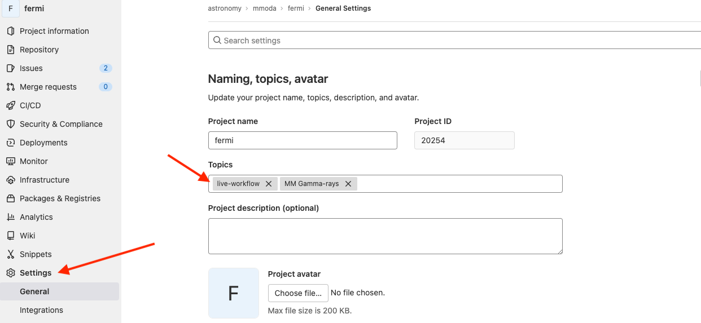
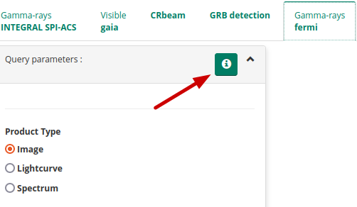

# [MMODA](https://www.astro.unige.ch/mmoda) workflow development Guide

The [MMODA](https://www.astro.unige.ch/mmoda) platform provides access to the Astronomical Open Research Data Analysis Services (ORDAS). Good fraction of these services follow a simple scheme, they:  
* access publicly available external astronomical data archives to fetch data relevant to specific source or source catalog,
* transform the fetched data using a workflow based on a Python notebook to derive a data product.
* display a preview of the data product on the [MMODA](https://www.astro.unige.ch/mmoda) frontend and/or return the data product to the user via  Python [API](https://github.com/oda-hub/oda_api)

The users of [MMODA](https://www.astro.unige.ch/mmoda) are encouraged to become its developers and add new ORDAS. This help page provides a step-by step instructions on how to add new services to [MMODA](https://www.astro.unige.ch/mmoda) .

Workflows are all things that can be computed, broadly speaking. For reproducibility, we want our workflows to be repeatable: producing the same output every time they are computed. This looks easy enough in first approximation, but might be harder to achieve than it seems when the workflow relies on external data and compute resources  and has to yield an "up-and-running" ORDAS in an ever-evolving compute environment. This help page is also aimed at helping the developers in ensuring reproducibility and reusability of their workflows converted to ORDAS.

## Build a repeatable parameterized workflow

Suppose you have a [**jupyter notebook**](https://renkulab.io/projects/astronomy/mmoda/fermi/files/blob/Lightcurve.ipynb) that derives some useful information (a lightcurve in the GeV gamma-ray band) on an astronomical source  from data found in an astronomical data archive (in our example, it will be [Fermi LAT data archive](https://fermi.gsfc.nasa.gov/ssc/data/access/)). 

The first essential step in promoting the notebook to an ORDAS is to make the workflow of the notebook **reusable** by parameterizing it. For example, it is initeresting to enable generation of similar data products for different sources, by simply giving the source name or coordinates as **input parameters** to the workflow. It is also useful to explicitly tag the resulting data product (the lightcurve in our example) as the **output**, to make clear which of the numerous entities generated by the notebook is the final result. It is also possible to convert non-parametrized but strickly repeatable notebooks to services (for example, to assure reproducibility of a result published in a research publication), but this is less interesting since they always produce the same output data products. 

### How to designate input parameters and output cells of the notebook 

In [MMODA](https://www.astro.unige.ch/mmoda) we use the approach of [papermill](https://papermill.readthedocs.io/en/latest/usage-parameterize.html#designate-parameters-for-a-cell)) to **tag** the notebook cells that contain the input parameters and the outputs. In your notebook, you may create two dedicated cells with the "parameters" and "outputs" tags. In the Jupyter Lab environment this can be done by clicking on the cogwheel sign on the right top, red arrow in the image below, and adding new tag as pointed by the second red arrow:


### How to define input parameters in the dedicated parameters cell 

The variables defined in the dedicated "parameters" cell, will be the input parameters of the workflow. They will be visualized in the frontend of the service and it will be possible to provide these parameters via the service [API](https://github.com/oda-hub/oda_api). For example, in the image of the parameters cell in our example (see above)
  * the names of the declared variables will be used as parameter names in the [MMODA](https://www.astro.unige.ch/mmoda) service (except the **default** parameters, see below). For example, the `Source_region_radius` variable will be visible in the frontend as a query parameter with the same name. It will appear with a default value assigned to it (`2.` in the example notebook). 
  * if not annotated, the types of the inputs parameters are determined based on the parameter default value (would be `float` for the `Source_region_radius` parameter).
  * otherwise, it is possible to customize the parameter by adding annotation the input parameter with an MMODA [ontology](https://odahub.io/docs/guide-ontology) item as a comment (after the hash sign, `#http://odahub.io/ontology#AngleDegrees` in the reference example of the `Source_region_radius` parameter. This may be useful for checking the validity of the user inputs. For example, the sky angle in degrees (defined by the `#http://odahub.io/ontology#AngleDegrees`) should be a float number and can take values between 0 and 360. 
  * it also possible to directly express additional restrictions on the parameter value by using annotation properties `oda:lower_limit`, `oda:upper_limit`, `oda:allowed_value`. For example, to define an angle with maximum value of 10deg, the annotation will be `# oda:AngleDegrees; oda:upper_limit 10.` Another example is a string parameter with possible values of "b", "g", "r": `oda:String; oda:allowed_value 'b','g','r'.`
  * to explicitly express units of the parameter, one can use predefined `oda:ExpressedInUnit` subclasses, like `# oda:Float; oda:GeV` or annotation property, like `# oda:Float; oda:unit unit:GeV`.


### Default parameters

Several **default** common parameters are always set by the [MMODA](https://www.astro.unige.ch/mmoda) frontend. These include:

  | Type annotation | Parameter default name |
  | ---------------- | -------------- |
  | http://odahub.io/ontology#PointOfInterestRA | RA |
  | http://odahub.io/ontology#PointOfInterestDEC | DEC |
  | http://odahub.io/ontology#StartTime | T1 |
  | http://odahub.io/ontology#EndTime | T2 |
  | http://odahub.io/ontology#AstrophysicalObject | src_name |
  
The default parameters are common to all workflows in the [MMODA](https://www.astro.unige.ch/mmoda) ecosystem. They appear at the top of the [MMODA](https://www.astro.unige.ch/mmoda) frontend as shown below:



If the notebook contains parameters anotated with these types, their names will be automatically considered as the parameters appearing in the common parameter field of all services. If some of them are ommited, they will be added to the list of workflow parameters automatically. 

Note that both **source name** and  **source coordinates** are passed to the workflow, and in principle there is no guarantee the coordinates are that of the source. We leave it up to the workflow developer to reconcile these parameters. Please explain the logic in the associated help page of the service.

### Adding annotations the entire notebook

Annotations can apply to parameters or entire notebook. In both cases they are kept in the notebook cell tagged `parameters`.
For example:

```
# oda:version "v0.1.1"
# oda:reference "https://doi.org/10.1051/0004-6361/202037850"

source_name = "Crab" # oda:AstrophysicalObject
reference_energy = 20 # oda:keV
```   
 ### How to annotate the notebook outputs

A cell tagged "outputs" defines the data product(s) that will be provided by the service:


The outputs may be strings, floats, lists, numpy arrays, astropy tables etc. They may be also strings which contain filenames for valid files. If they do, the whole file will be considered as the output.  Similar to the "parameters" cell, the "outputs" cell should contain the definitions of the output variables followed by equality that assigns values to them and a comment that defines their type (for example, the variable `lightcurve_astropy_table` in the example shown above takes the value `lightcurve` which is an astropy table. the comment field `# http://odahub.io/ontology#ODAAstropyTable` specifies this in terms of the MMODA [ontology](https://odahub.io/ontology/). If you want to give more detailed description of the notebook input and output, use `terms` from the pre-defined ontology described  [here]([docs/guide-ontology.](https://odahub.io/docs/guide-ontology)).

There is also one special type of the output annotation `# http://odahub.io/ontology#WorkflowResultComment`. An output variable of string type, annotated with it will be returned as a comment, shown in yellow field upon completion of the job.

### Quering external astronomical data archives from a notebook

It is very likely that your analysis workflow needs to access astronomical data retrievable from an external archive. A good practice is to avoid placing  large volumes of data direcly into the container where the analysis notebook runs (this would overload the [renkulab.io](https://renkulab.io) platform which we use for new service deployment).  A better approach is to query the relevant data using online services, for example, [Table Access Protocol (TAP)](https://www.ivoa.net/documents/TAP/) services, or services available through the [astroquery](https://astroquery.readthedocs.io/en/latest/index.html) Python module. In our example case of Fermi/LAT analysis, we use the [astroquery.fermi](https://astroquery.readthedocs.io/en/latest/fermi/fermi.html) module to query the archive of publicly available Fermi/LAT data from [Fermi Science Support Center](https://fermi.gsfc.nasa.gov/ssc/) in the Cell 4 of the notebook [Lightcurve.ipynb](https://renkulab.io/projects/astronomy/mmoda/fermi/files/blob/Lightcurve.ipynb). 

Of course, relying on external data archives and data access services may pose a problem for reproducibility of results and potentially for the service operational stability. The external services may have downtime period, they may be upgraded and change their API etc. We leave it to the developer to make sure the requests to external services are operational and reproducible. We encourage the developers to supply tests (see [guide](https://odahub.io/docs/guide-development/#how-to-add-a-test-to-the-notebook)) that will be automatically executed from time to time during service operations and are supposed to always yield exactly the same results. If this is not so, this may signal a problem with non-availability of some external services, in this cases you, as the service developer, will be alerted and invited to investigate the origin of the problem.  It may also happen that the notebook would not produce the exactly
the same result every time but still be reproducible (see motivation on [the difference between reproducibility and repeatability](https://github.com/volodymyrss/reproducibility-motivation/)). 

### Handling exceptions

It can happen that your analysis workflow is expected to produce no data products in some cases, for example, if there is no data for a specified source and time interval, if the parameters specified by the user have wrong format, or in other "exceptions"  In this case, it would be good to inform the user what happened. This can be done using the raise `RuntimeError()` method directly in the notebook, as shown below: 


Don't worry if you do not succeed to foresee all possible exceptions at the initial development stage. If unforeseen exceptions would occur when the service is already deployed and available to users, each time an unforeseen exception occurs, you will be notified and invited to patch your notebook to handle this exception (perhaps raising a new `RuntimeError()` case in the appropriate cell).

### How to add a test to the notebook

It is a good practice to test the developed notebook. This allows to make sure that the code remains valid in the future.
A test is implemented as another notebook, except that name of the notebook starts with "test_". The notebook should call other notebooks and check that the output matches expectations. See an example of such a test [here](https://gitlab.renkulab.io/astronomy/mmoda/mmoda-nb2workflow-example/-/blob/master/notebooks/test_lightcurve.ipynb). 

### Reporting progress for long running tasks

In case your computation task runs considerable amount of time and can be split into stages
consider reporting task progress using ODA API class ProgressReporter:
```
from oda_api.api import ProgressReporter
pr = ProgressReporter()
pr.report_progress(stage='simulation', progress=0, substage='step 1')
# implement step 1
pr.report_progress(stage='simulation', progress=50, substage='step 2')
# implement step 2
```   

 ## Make the notebook available for deployment on [MMODA](https://www.astro.unige.ch/mmoda/) via [renkulab.io](https://renkulab.io/)

The parameterized workflow formulated as a Python notebook can be converted into a service provided by [MMODA](https://www.astro.unige.ch/mmoda/)  by a bot that scans a specific location `astronomy/mmoda` in the project directory on the  [renkulab.io](https://renkulab.io/) collaborative platform. Creating a new project in this directory will make it visible for the bot. In our example of Fermi/LAT lightcurve workflow, it is in the [fermi](https://renkulab.io/projects/astronomy/mmoda/fermi) subdirectory of `astronomy/mmoda`.

To proceed along this way, you first you need to make sure your notebook runs correctly in the  [renkulab.io](https://renkulab.io/) environment. You can start a new project in the `astronomy/mmoda` by clicking on the "Creat new project" button.


You will need to choose the name of the new project. This name will be the name of your service appearing at the [MMODA](https://www.astro.unige.ch/mmoda) frontend and discoverable via [MMODA](https://www.astro.unige.ch/mmoda) API. Place your project in the `astronomy/mmoda` namespace by specifying this in the "Namespace" field as shown below:



Choose the "Python 3" template for the project and then click "Create project" button:



To start working on the newly created project, you can launch an interactive Jupyter lab session by clicking on the "Start" button:



Once in the Jupyter lab environment, you can update the project by uploading the notebook that you intend to promote to a service:


Your notebook most probably imports some python packages that are not installed by default in a generic Python environment on [renkulab.io](https://renkulab.io). To add necessary packages, you need to update the `requirements.txt` and possibly `environment.yml` files with the packages you need:


In the example of Fermi/LAT analysis we are considering, packages `astropy`, `matplotlib` and `astroquery` packages will be needed. They can be added in the requirements.txt file as shown above.

Once you are done with uploading your notebook and adding missing Python packages into the requirements.txt file, you can commit changes to your project by going to the GitLab tab in the Jupyter lab interface. You will see files that have been added or modified appearing as such in the dedicated sub-panel as shown below:



Promote these files to the "Staged" state by clicking at the "+" signs next to them and commit changes to your project by clicking at the "Commit" buttong just below the file list. Next, push the comitted changes to the Gitlab by pressing the "push" button (see the screenshot above).  

Now the CI/CD of the Gitlab will generate a new container in which all necessary Python packages and the notebook to be promoted to a service will be available. This may take a few minutes. You can test this new container in operation if you start a new interactive session on renkulab.io, using the container produced from your latest commit. 

If the notebook runs as expected and produces correct outputs, you may proceed to the next stage and deploy a new service. 

<!-- #### (optional) Try a test service

* install nb2workflow tooling `pip install 'nb2workflow[cwl,service,rdf,mmoda]>=1.3.30' --upgrade`. Note that his command should be the only one you need to install the necessary dependencies for the workflow engine. You may of course also need some domain-specific packages .
* inspect the notebook `nbinspect my-notebook.ipynb`
* try to run the notebook `nbrun my-notebook.ipynb`
  * it will use all default parameters 
  * you can specify parameters as `nbrun --inp-nbins=10 my-notebook.ipynb`, if `nbins` happens to be one of the parameters.
 try to start the service `nb2service my-notebook.ipynb`


if you experience issues testing the service due to some "import error" or other strange messages try containerized service (note that it will not work in Renku):

* `nb2deploy $PWD test --local`
* then, look onto http://0.0.0.0:8000 for some metadata about the service
* try to run some simple queries in http://0.0.0.0:8000/apidocs/



If you still experience issues with local environment, try to develop the workflow directly in [renkulab]() - note that some commands, `like nb2deploy`, will not work in this case.
 -->


## Publish your workflow as an **MMODA** service
If you project is in the `/astronomy/mmoda/` namespace, it is straightforward to convert it into a [MMODA](https://www.astro.unige.ch/mmoda) service. All you need to do is to add a `live-workflow` as a topic at the project Gitlab that you can access by clicking on the "GitLab" button at  the main project page on renkulab.io:


At the GitLab webpage, go to the "Settings" section, the "Topic" field is in the "General" settings:



Note that you may add multiple topics in this field. In the example of Fermi/LAT shown above, there is an additional topic "MM Gamma-rays" that helps [MMODA](https://www.astro.unige.ch/mmoda) users to classify workflows by the messenger and waveband types. Any topic which starts with "MM " (note the space) will be shown as a messenger label in MMODA, excluding the "MM " prefix. The additional topic will appear in the name of the tab of your workflow on [MMODA](https://www.astro.unige.ch/mmoda) frontend. The topics associated to your project are visible right below the project name on the Gitlab pages:


Once the project is associated to the `live-workflow` topic, it becomes visible to a bot that periodically scans the Gitlabs of the projects in the `astronomy/mmoda` domain, looking for new or modified "live" workflows that propose themselves as online services for MMODA. The bot will try to convert your notebook into a service and if this works, it will automatically add the new service  [MMODA](https://www.astro.unige.ch/mmoda) (by default, on to its staging instance). You can monitor the progress of the bot work if you visit the "COntinuous Integration / Continuous Development" (CI/CD) section of the GitLab page of your project. It will show that a pipeline is in progress, both on the build of the updated renkulab project container image and on the "External" MMODA side:


Once the deployment is finished, you will recieve an email similar to this:


You may now connect to the [MMODA](https://www.astro.unige.ch/mmoda) frontend to test the functionalities of your service, check the correctness of appearance and format of the input parameters that you have specified in the `parameters` cell of the notebook, check the formatting and correctness of the data products that are produced upon pressing the "Submit" button on the frontend etc:


Note that some of the input parameters in the example of the Fermi/LAT [Lightcurve.ipynb](https://renkulab.io/projects/astronomy/mmoda/fermi/files/blob/Lightcurve.ipynb) notebook appear as multiple choice parameters with pre-defined values, while others are query fields. For some of the parameters, units are specified just below the query window. The names of the parameters are the names of the variables defined in the `parameters` cell of the notebook (see the screenshot of the parameters cell in the [section above](#build-a-repeatable-parameterized-workflow) of this help page. Have a look in the example how this is regulated with parameter annotations.

If the `outputs` cell of your notebook contains multiple data products, they will be shown as a list at the [MMODA](https://www.astro.unige.ch/mmoda) frontend, as shown above. The names of the list items correspond to the names of the variables defined in the `outputs` cell. Each item of the list can be previewed or downloaded by clicking on the "View" button. The preview will depend on the type of the data product that has been specified after the comment  hash `#` tag in the `outputs` cell. 

You can explore different examples of the notebooks converted to services in the `astronomy/mmoda` domain on renkulab.io, to see how to format the inputs and outputs. If unsure, first take a look on [this simple repository](https://renkulab.io/projects/astronomy/mmoda/mmoda-nb2workflow-example). You can also experiment with further possibilities exploring the [ontology](https://odahub.io/ontology/) of the [MMODA](https://www.astro.unige.ch/mmoda) parameters and data products. 

By default, all notebooks residing in the root of the repository (except the ones named as `test_*.ipynb`) will be converted to separate data-products. If notebooks are in the subdirectory, one needs to add the configuration file `mmoda.yaml` with
`notebook_path: "subfolder/path"`. It's also possible to include only some notebooks by putting into `mmoda.yaml` e.g. `filename_pattern: "prefix_.*"` to define the notebook name regex pattern.

To add a help for the workflow one have to create a file `mmoda_help_page.md` in the root of the repository. This file will be converted by the bot to the help page, associated with the corresponding instrument tab in the MMODA platform interface.




The file `aknowledgemets.md` is used to edit the acknowledgements text, which is shown at the bottom of the products window. The default text refers to the renku repository, in which the workflow was created.


<!--  ####  Try to access your new service

* Assuming `lightcurve-example` from above was used, and the notebook name was `random`, you can run this:

```bash
$ oda-api -u https://dispatcher-staging.odahub.io get -i lightcurve-example -p random -a n_bins=5
```-->

### Support the workflow development via renku plugin  

To support the development of workflows in Renku, a set of dedicated funcitonailities, provided as Renku plugins, are made available. Specifically, these plugins aim to achieve the following:

* Offer a visualization of the project's Knowledge Graph (`renku-graph-vis` plugin)
* Intercept calls to `astroquery` functions and store them in the project's Knowledge Graph (`renku-aqs-annotation` plugin)

See below how to install these plugins, which are not available by default.

#### Visualizing project Knowledge Graph with `renku-graph-vis` plugin

This plugin provides a graphical representation of the renku repository's knowledge graph, possibly from within the renku session.

The plugin provides two CLI commands:
  * `display` to generate a representation of the graph over an output image
  * `show-graph` to start an interactive visualization of the graph over the browser

Furthermore, the plugin provides an interactive graph visualization feature for real-time monitoring during a renku session. To initiate or access the live graph visualization during your session, simply click on the Graph icon located on the main page, as shown in the image below.


The primary benefit introduced is the ability to have a live overview of the ongoing development within an interactive Renku session. This can be seen within the animation below, where the graph is automatically updated with information about the execution of a notebook upon its completion.


This visualization also includes the ODA ontology, providing valuable insights into the types of entities within it that are known to the ontology, and therefore helping during the workflow development. The image below displays a graph where the ODA ontology has been imported, and it can be seen that the `SimbadClass` node is an instance of the `AstroqueryModule` class, while `Mrk 421` is an instance of the `AstrophysicalObject` class.


More technical details are presented in the README of the repo page: [https://github.com/oda-hub/renku-graph-vis/](https://github.com/oda-hub/renku-graph-vis/)

##### Installation

The plugin can be installed via pip on your own environment:

```bash
pip install renku_graph_vis
```

Alternatively, it can be made available within a Renku session by adding it in the list of requirements of the Renku project, within your `requirements.txt` file.

#### Tracking access to astronomical archives and services in the project Knowledge Graph by using `renku-aqs-annotation` plugin

This plugin intercepts several key `astroquery` methods and stores annotations containing information about the calls to these methods (like the arguments used in the call) to the project's Knowledge Graph: [https://github.com/oda-hub/renku-aqs-annotation](https://github.com/oda-hub/renku-aqs-annotation)

In the image below, the information added to the project Knowledge Graph is highlighted. Specifically, it can be seen that during a papermill run of the `test-notebook.ipynb` notebook (that produced `out.ipynb` as an output notebook) a call to the astroquery method `query_object`, via the `Simbadclass`, has been detected. This notebook is requesting the object `Mrk 421` object. The hightlighed labels on the edges provide information about the relationship between the two nodes: during the `papermill` execution, a call to the `query_object` method is executed (`call` label) and in turn, this requests the Astrophysical Object `Mrk 421`.


##### Installation

The plugin can be installed either via pip on your own evironment:

```bash
pip install renku_aqs_annotation
```

Just like the `renku_graph_vis` plugin, the `renku_aqs_annotation` plugin can be made available within a Renku session by adding it to the list of requirements in your `requirements.txt` file for the Renku project.

### Inform **MMODA** team and suggest automatic test cases to ensure service stability 

Please contact [MMODA](https://www.astro.unige.ch/mmoda) team (see contact form) to inform that you have created a new Open Research Data Analysis Service (ORDAS). We will check the functionalities and stability of your service, and we can inform the user community on availability of this new service. We will also ask you to suggest automatic tests of service operations that will be performed from time to time, to  make sure your service does not break with future updates or because of unavailability of external services providing the input data for your analysis workflow. We can also add acknowledgements to the data providers and to you as the workflow developer. 

